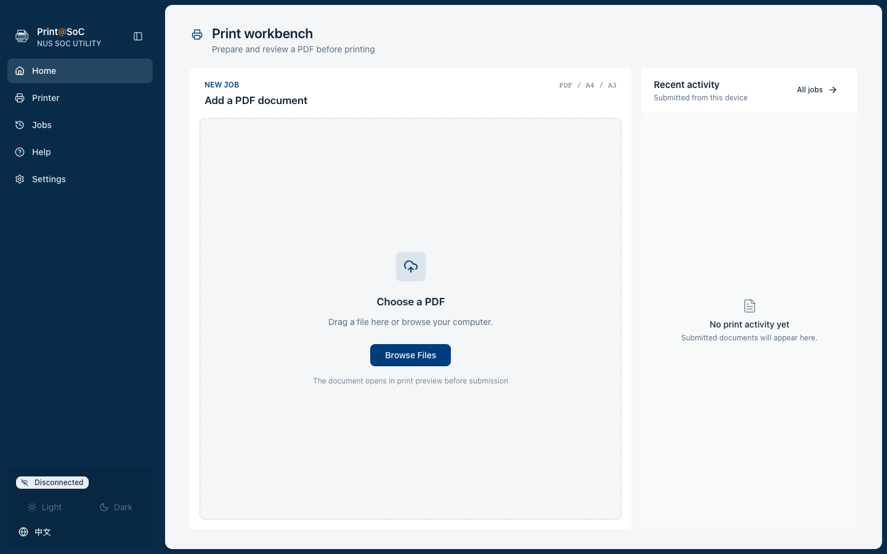

# Print@SoC

> This project began as an experimental solution to simplify printing for NUS School of Computing students. It has evolved into **Print@SoC**, a secure, zero-configuration cross-platform and easy-to-use printing tool designed for NUS students and staff.

---

## Interface



The interface uses a responsive workbench layout: document submission and recent
activity share the available desktop workspace, while mobile views stack tasks in
their natural order. Connection details remain in Settings and print options are
confirmed in Preview, keeping Home focused on the next print job.

---

## Problem Statement

### The Challenge with Official SoC Printing Configuration

While NUS School of Computing provides comprehensive printing infrastructure with printers across COM1, COM2, COM3, and other buildings, the official setup process presents significant challenges:

#### Traditional Setup Process (Official Documentation)

For macOS users, the official configuration requires:

1. Open System Settings → Printers & Scanners
2. Click "Add Printer"
3. Select IP Printer
4. Enter printer address: `print.comp.nus.edu.sg`
5. Select protocol: IPP (Internet Printing Protocol)
6. Enter queue name (e.g., `psts-dx`)
7. Download and install printer drivers (PPD files)
8. Configure paper size, duplex printing, and other options
9. ...15+ additional steps

#### Critical Issues

- Documentation written in 2015 for macOS 10.10, incompatible with modern macOS Ventura/Sonoma
- Outdated drivers that fail on newer operating systems
- Complex 15+ step configuration process prone to errors
- Each printer requires separate configuration
- Difficult troubleshooting when setup fails
- Platform-specific instructions (different for Windows, macOS, Linux)

#### Real Student Experience

> "I just wanted to print my assignment, but spent 2 hours configuring the printer and still failed."

**Setup Time:** 1-3 hours
**Success Rate:** ~60%

---

## Solution: Print@SoC

### Core Innovation

Instead of configuring local printer drivers, Print@SoC leverages SSH + `lpr` to bypass configuration complexity entirely.

#### Architecture Comparison

**Traditional Approach:**
```
macOS → Printer Driver → IPP Protocol → SoC Print Server → Printer
        ❌ Complex      ❌ Outdated    ❌ Poor compatibility
```

**Print@SoC Approach:**
```
Any Device → Print@SoC App/CLI → SSH → stu/stf Server → lpr → Printer
            ✅ Zero config      ✅ Automatic   ✅ Cross-platform
```

#### Key Insight

SoC students already have SSH credentials for accessing university servers and submitting assignments. Why not use the same SSH access for printing, eliminating local driver configuration entirely?

### User Experience

**With Print@SoC:**

1. Open Print@SoC
2. Log in with SoC credentials
3. Upload PDF file
4. Select printer queue
5. Click Print

**Setup Time:** 2 minutes
**Success Rate:** 95%+

---

## How It Works

### Technical Architecture

```
┌─────────────────────────────────────────┐
│      SoC Print Server                   │
│   (print.comp.nus.edu.sg)               │
│                                         │
│  ┌─────────────────────────────────┐   │
│  │  CUPS (Print Queue Manager)     │   │
│  │  - psc008-dx / psc008-sx        │   │
│  │  - psc011-dx / psc011-sx        │   │
│  │  - psts-dx  / psts-sx           │   │
│  └─────────────────────────────────┘   │
│           ▲                             │
│           │ Accepts lpr commands        │
└───────────┼─────────────────────────────┘
            │
    ┌───────┴───────┐
    │               │
    │ Method 1      │ Method 2
    │ IPP Protocol  │ SSH + lpr
    │ (Config req.) │ (Zero config)
    │               │
┌───▼──┐      ┌────▼─────┐
│Local │      │stu/stf   │
│Print │      │Server    │
│Setup │      │(SSH)     │
└──────┘      └──────────┘
```

### Behind the Scenes

When you upload `assignment.pdf`:

```bash
# 1. Upload file to server
scp assignment.pdf stu.comp.nus.edu.sg:~/temp/

# 2. Submit print job via lpr
ssh stu.comp.nus.edu.sg "lpr -P psts-dx ~/temp/assignment.pdf"

# 3. Check print queue status
ssh stu.comp.nus.edu.sg "lpq -P psts-dx"

# 4. Cleanup temporary file
ssh stu.comp.nus.edu.sg "rm ~/temp/assignment.pdf"
```

All of this happens automatically - users simply upload and print.

Print@SoC defaults to `psts-dx`, one of the common public SOCprint queues in
COM1 Level 1. The student-facing default list follows SOCprint's common public
queues: `psc008-dx`, `psc008-sx`, `psc011-dx`, `psc011-sx`, `psts-dx`,
`psts-sx`, `pstb-dx`, `pstb-sx`, `pstc-dx`, and `pstc-sx`. After SSH
connection, the app also asks the selected SoC Unix server for `/etc/printcap`
and filters the visible queues against that live list.

### Why This Works

- ✅ `stu.comp.nus.edu.sg` and `stf.comp.nus.edu.sg` are within the campus network
- ✅ These servers have direct access to the print server
- ✅ Students already have SSH credentials
- ✅ The `lpr` command is available on these servers

---

## Key Advantages

| Dimension | Traditional Setup | Print@SoC |
|-----------|------------------|-----------|
| **Configuration** | 15+ manual steps | Zero configuration (credentials only) |
| **OS Compatibility** | Poor (outdated drivers) | Excellent (SSH-based) |
| **Cross-platform** | Different setup per OS | Identical across all platforms |
| **Maintenance** | High (reconfigure after OS updates) | Low (stable SSH) |
| **Troubleshooting** | Difficult (driver? network? config?) | Simple (clear SSH error messages) |
| **Learning Curve** | Steep (IPP/CUPS knowledge required) | Minimal (web interface) |

---

## Target Users

### Primary Audience

**Students (Undergraduate & Graduate)**
- Need to print assignments, lecture notes, and papers
- Familiar with SSH (Computer Science background)
- Want hassle-free printing without driver configuration

**Faculty & Staff**
- Use personal macOS/Windows computers
- Need to print course materials and exams
- Require quick and reliable printing

---

## Features

- **Zero Configuration:** No driver installation or printer setup required
- **Cross-Platform:** Works on macOS, Windows, Linux - any device with a browser
- **Secure:** Uses your existing SoC SSH credentials
- **Booklet Mode:** Automatic page arrangement for booklet printing
- **PDF Optimization:** Smart layout optimization for better print quality
- **Queue Management:** View and manage your print jobs
- **Multi-Printer Support:** Easy access to all SoC printer queues
- **CLI Aliases:** Launch with `print-at-soc`, `print-soc`, or `psoc`
- **MCP Server:** Start a local stdio MCP server with `print-soc mcp` or `psoc mcp`

---

## Technical Stack

- **Desktop Backend:** Tauri + Rust
- **SSH Integration:** `ssh2` for secure connections
- **PDF Processing:** Rust PDF tooling for layout optimization
- **Frontend:** React with modern UI components
- **Authentication:** SSH password is kept in memory for the active session; “remember account” stores only server and username

---

## Getting Started

### Prerequisites

- NUS SoC account credentials
- Access to NUS campus network (on-campus or VPN)

### Installation

Download the latest release for your platform from the [Releases](../../releases) page:

- **macOS Apple Silicon:** `Print_at_SoC_macos_aarch64.app.tar.gz`
- **macOS Intel:** `Print_at_SoC_macos_x86_64.app.tar.gz`
- **Windows:** `Print_at_SoC_windows_x86_64_setup.exe`
- **Linux:** `Print_at_SoC_linux_x86_64.AppImage`

Or install a CLI wrapper:

```bash
npm install -g print-at-soc
print-soc

pip install print-at-soc
psoc
```

### Virtual Printer

The Python CLI can install a macOS/Linux CUPS virtual printer queue. Apps print
to `Print@SoC Virtual Printer`, and the backend forwards the spool file through
SoC SSH to the configured remote `lpr` queue. The default remote queue is
`psts-dx`; pass `--printer` to choose another SOCprint queue.

```bash
pip install print-at-soc
print-soc --install-virtual-printer --username your-soc-id --ask-password --printer psts-dx
```

Useful maintenance commands:

```bash
print-soc --configure-virtual-printer --server stu --username your-soc-id --ask-password --printer psts-dx
print-soc --virtual-printer-status
print-soc --uninstall-virtual-printer
```

Run `print-soc --uninstall-virtual-printer` before `pip uninstall print-at-soc`.
`pip uninstall` removes Python files only; it does not remove CUPS queues,
backend files, or Print@SoC configuration created outside pip metadata.

Windows virtual printer support is separate because Windows uses the modern
Print Support App/MSIX virtual printer architecture rather than CUPS backends.

### MCP Server

The desktop binary includes a stdio MCP server. Open **Settings → Advanced** to
run a handshake test and copy a client configuration that points to the exact
installed executable. The same page reports the CLI, CUPS queue, backend,
configuration file, and loaded Tauri plugins without assuming they are present.
After installing the Python CLI, the server is also available through either CLI alias:

```bash
print-soc mcp
psoc mcp
```

The MCP server exposes SSH connection, printer queue, quota, and PDF print submission tools. `submit_pdf_print_job` requires `confirm=true` because it sends a real print job.

An installable Codex plugin scaffold is included at `plugins/print-soc`. It
registers `print-soc mcp` and provides guarded printing instructions. Validate it
from the Codex plugin-creator skill before distribution; the target machine must
have the `print-soc` CLI on `PATH`.

### First-Time Setup

1. Launch Print@SoC
2. Select your preferred print server (`stu` or `stf`)
3. Enter your SoC username and password
4. Start printing

---

## Development

### Project Structure

```
Print-SoC/
├── app/                  # Tauri desktop application
│   ├── src/              # React frontend
│   ├── src-tauri/        # Rust backend and bundled MCP server
│   ├── public/           # Static assets
│   └── package.json      # Frontend scripts and dependencies
├── plugins/print-soc/    # Codex plugin and MCP registration
└── release/              # CLI packages and release assets
```

### Building from Source

```bash
# Clone repository
git clone https://github.com/Qingbolan/Print-SoC.git
cd Print-SoC

# Install dependencies
cd app
npm install

# Run the desktop app in development
npm run tauri:dev

# Run frontend and design checks
npm run check

# Build desktop packages
npm run tauri:build
```

---

## Roadmap

- [ ] Support for additional print options (color, stapling, etc.)
- [ ] Print history and cost tracking
- [ ] Batch printing support
- [ ] Mobile app version
- [ ] Integration with LumiNUS for direct assignment printing

---

## Contributing

Contributions are welcome! This project aims to improve the printing experience for the entire SoC community.

1. Fork the repository
2. Create a feature branch (`git checkout -b feature/improvement`)
3. Commit your changes (`git commit -am 'Add new feature'`)
4. Push to the branch (`git push origin feature/improvement`)
5. Open a Pull Request

---

## License

This project is licensed under the MIT License - see the [LICENSE](LICENSE) file for details.

---

## Acknowledgments

Built with the needs of NUS School of Computing students in mind. Special thanks to all early testers who provided valuable feedback.

**Print@SoC** - Because printing should be simple.
